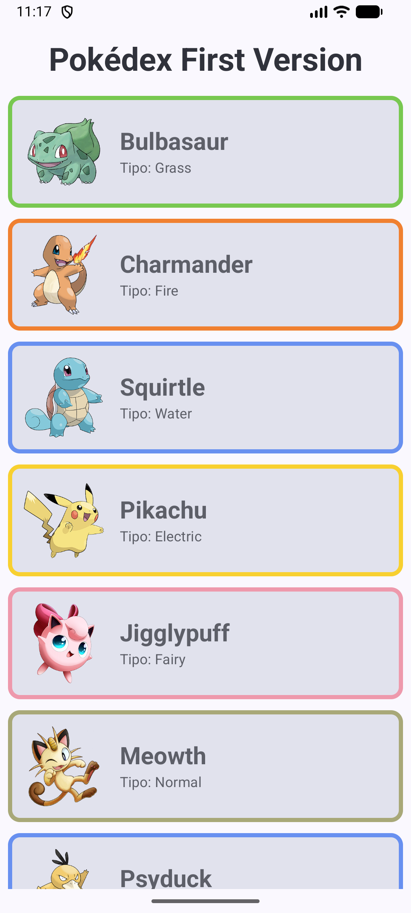
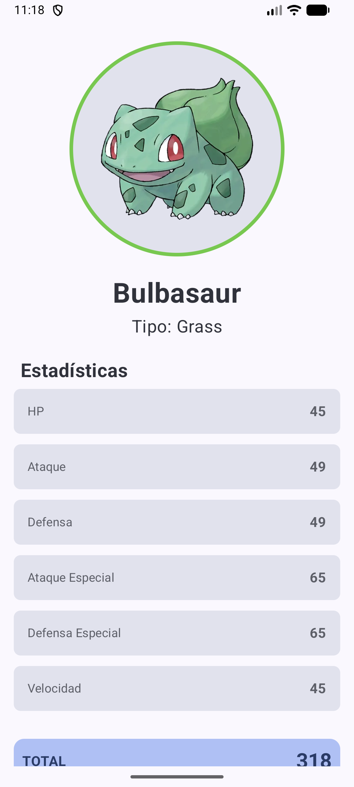

# 📱 Pokédex First Version - Aplicación de Lista de Pokémon

Aplicación Pokédex desarrollada en **Kotlin** con **Jetpack Compose** siguiendo el patrón de arquitectura **MVVM** con componentes Lazy.

## 📱 Descripción

Pokédex First Version es una aplicación Android que muestra una lista interactiva de Pokémon con información detallada de cada uno, incluyendo estadísticas completas y características visuales según su tipo.

## ✨ Características

- 📋 **Lista de Pokémon**: Visualización de 14 Pokémon con LazyColumn
- 🎨 **Bordes de colores**: Cada Pokémon tiene un borde de color según su tipo
- 📊 **Estadísticas detalladas**: HP, Ataque, Defensa, Ataque Especial, Defensa Especial y Velocidad
- 🔢 **Cálculo de total**: Suma automática de todas las estadísticas
- 🎯 **Vista detalle**: Pantalla completa con información ampliada de cada Pokémon
- 🧭 **Navegación fluida**: Sistema de navegación entre lista y detalle
- 🎨 **Interfaz moderna**: Desarrollada con Jetpack Compose y Material Design 3

## 🏗️ Arquitectura

El proyecto sigue el patrón **MVVM (Model-View-ViewModel)** con LiveData para gestión reactiva de datos:

```
├── model/
│   └── Pokemon.kt              # Data classes (Pokemon y PokemonStats)
├── repository/
│   └── PokemonRepository.kt    # Fuente de datos simulada
├── view/
│   ├── PokemonListScreen.kt    # Pantalla de lista
│   ├── PokemonDetailScreen.kt  # Pantalla de detalle
│   └── components/
│       └── PokemonItem.kt      # Componente de cada item
├── viewmodel/
│   └── PokemonViewModel.kt     # Lógica y gestión de estado
├── ui/theme/
│   ├── Color.kt                # Colores y función getTypeColor()
│   ├── Theme.kt                # Tema de la app
│   └── Type.kt                 # Tipografía
├── Routes.kt                   # Sistema de navegación
└── MainActivity.kt             # Actividad principal
```

## 🚀 Tecnologías Utilizadas

- **Lenguaje**: Kotlin
- **UI Framework**: Jetpack Compose
- **Arquitectura**: MVVM
- **Gestión de estado**: LiveData (MutableLiveData)
- **Navegación**: Navigation Compose
- **Material Design 3**: Material3 Components
- **Lazy Components**: LazyColumn para listas eficientes

## 📋 Funcionalidades Técnicas

### PokemonViewModel
- Gestión de estado reactiva con LiveData
- `_pokemonList`: LiveData para la lista de Pokémon
- `_selectedPokemon`: LiveData para el Pokémon seleccionado
- Funciones:
  - `loadPokemon()`: Carga la lista desde el repositorio
  - `selectPokemon()`: Selecciona un Pokémon para ver el detalle

### Sistema de Colores por Tipo
Función `getTypeColor()` centralizada en `Color.kt` que mapea cada tipo de Pokémon a su color característico:
- 🟢 Grass (Verde)
- 🔴 Fire (Rojo/Naranja)
- 🔵 Water (Azul)
- 🟡 Electric (Amarillo)
- 🟣 Poison (Morado)
- ⚪ Normal (Beige)
- 🩷 Fairy (Rosa)
- 🟤 Rock (Marrón)

### Navegación
- Sistema de rutas con sealed class
- Navegación entre pantallas:
  - `ListScreen` → `DetailScreen` → vuelta con botón

### LazyColumn
- Renderizado eficiente de la lista
- `verticalArrangement` con espaciado de 11dp
- `contentPadding` para evitar que el último elemento se corte

## 🎮 Cómo Usar la App

1. **Lista de Pokémon**: Visualiza todos los Pokémon disponibles
2. **Selección**: Toca cualquier Pokémon para ver sus detalles
3. **Vista Detalle**: 
   - Imagen con borde de color según tipo
   - Nombre y tipo
   - Estadísticas completas (6 stats + total)
4. **Volver**: Botón "Volver a la lista" para regresar

## 🛠️ Instalación

1. Clona el repositorio:
```bash
git clone https://github.com/tu-usuario/pr06-lazy-components-alexjimenez_alexandrasofronie.git
```

2. Abre el proyecto en **Android Studio**

3. Sincroniza las dependencias de Gradle

4. Ejecuta la aplicación en un emulador o dispositivo físico

## 📦 Requisitos

- Android Studio Hedgehog o superior
- Kotlin 1.9+
- Android SDK 24+ (Android 7.0)
- Gradle 8.0+
- Jetpack Compose

## 🎨 Capturas de Pantalla

### Lista de Pokémon


### Detalle de Pokémon


## 📊 Pokémon Incluidos

La aplicación incluye **14 Pokémon** con datos completos:

1. Bulbasaur (Grass)
2. Charmander (Fire)
3. Squirtle (Water)
4. Pikachu (Electric)
5. Jigglypuff (Fairy)
6. Meowth (Normal)
7. Psyduck (Water)
8. Golbat (Poison)
9. Rattata (Normal)
10. Spearow (Normal)
11. Ekans (Poison)
12. Vulpix (Fire)
13. Geodude (Rock)
14. Tentacruel (Water)

## 📝 Características del Código

- ✅ Patrón MVVM correctamente implementado
- ✅ LiveData para gestión reactiva de estado
- ✅ Código limpio y organizado
- ✅ Comentarios en español
- ✅ Separación clara de responsabilidades
- ✅ Uso de funciones privadas para encapsulación (`private fun StatItem`)
- ✅ Componentes reutilizables
- ✅ Sistema de colores centralizado

## 🎯 Requisitos de la Práctica Cumplidos

- ✅ Arquitectura MVVM con LiveData
- ✅ Data classes para representar elementos (Pokemon, PokemonStats)
- ✅ Mínimo 8 elementos instanciados (14 Pokémon creados)
- ✅ Uso de Lazy Components (LazyColumn)
- ✅ Vista de lista y vista de detalle implementadas
- ✅ Navegación entre pantallas
- ✅ Datos inicializados manualmente con imágenes locales

## 👨‍💻 Autores

**Alex Jiménez**  
**Alexandra Sofronie**

Desarrollo Aplicaciones Multiplataforma - La Salle

## 📄 Licencia

Este proyecto es parte de un ejercicio académico para la asignatura M07 - Android Studio.

---

⭐ **¡Gotta Catch 'Em All!** ⭐
